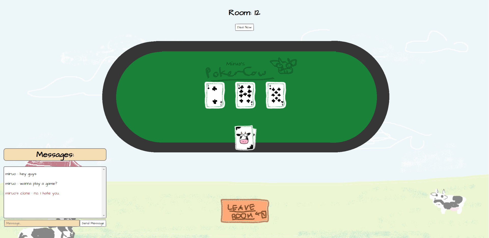
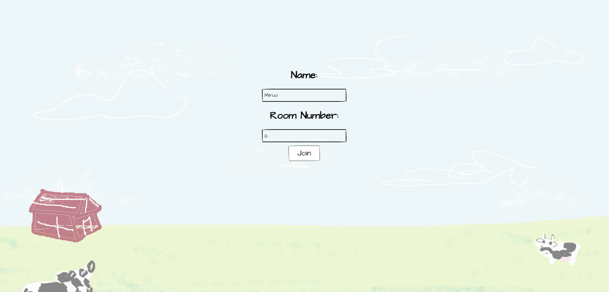

# PokerCow

A real-time multiplayer poker game built with **React** and **Socket.IO**, with game data stored in **PostgreSQL**.

All assets were hand-drawn in **Microsoft Paint** 🎨🐄

---

## 🕹️ Features

- Real-time multiplayer functionality using WebSockets  
- Custom hand-drawn poker assets  
- Persistent data storage with PostgreSQL

---

## 📸 Screenshots

 

---
